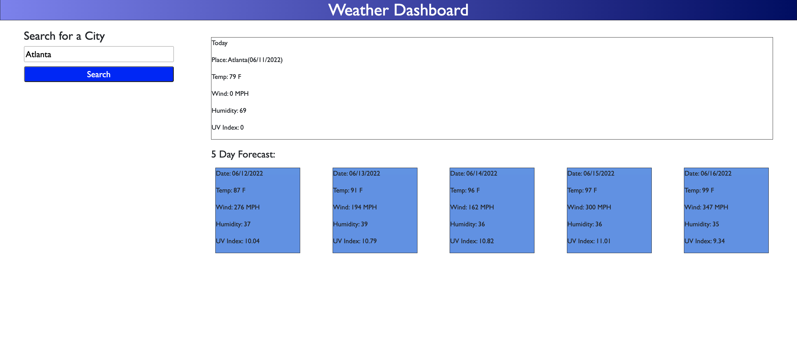

# Weather App

## user Story 

* Users should be able to weather outlook for multiple cities so that users can plan a trip accordingly.

## Acceptance Criteria 

GIVEN a weather dashboard with inputs
WHEN user search for a city, THEN user is presented with current and future conditions for that city
WHEN user views current weather conditions for that city, THEN user is presented with City name, date, humidity, wind speed, temperature and UV index
WHEN user views future forecast for that city, THEN user is presented with a 5-day forecast that displays date, temperature, wind speed, humidity and uv index

## Mock-Up screens:

* Home Page - Weather forecast 

github URL: https://github.com/Sivaparam/weather-app

Live URL:  https://sivaparam.github.io/weather-app/
